This project is bootstrapped with Vite+React and can be accessed [here](https://booknest78.vercel.app/).

# BookNest Client

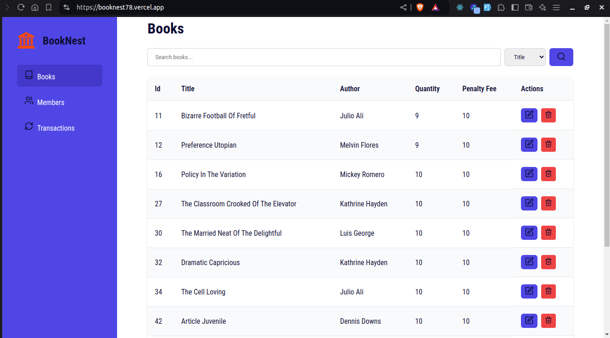

## Features

### 1. Books Page


### 2. Members Page

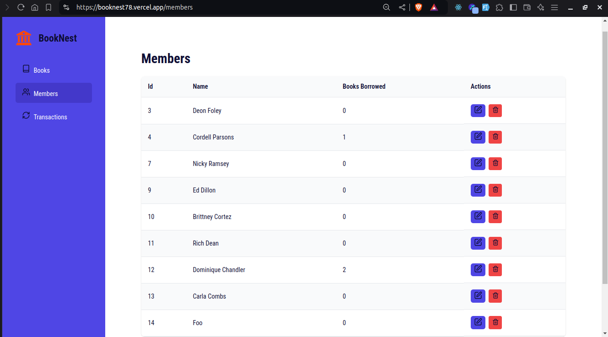

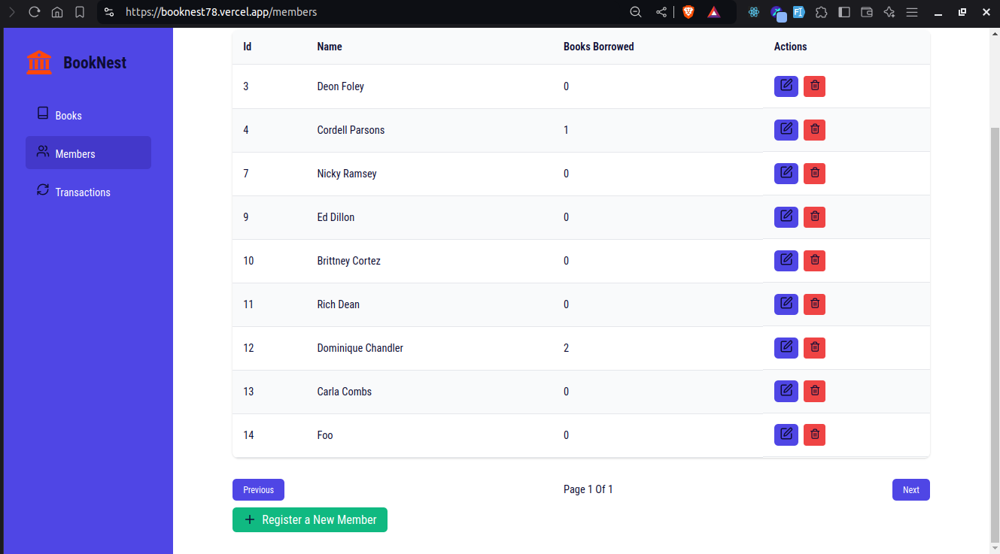

### 3. Transactions Page

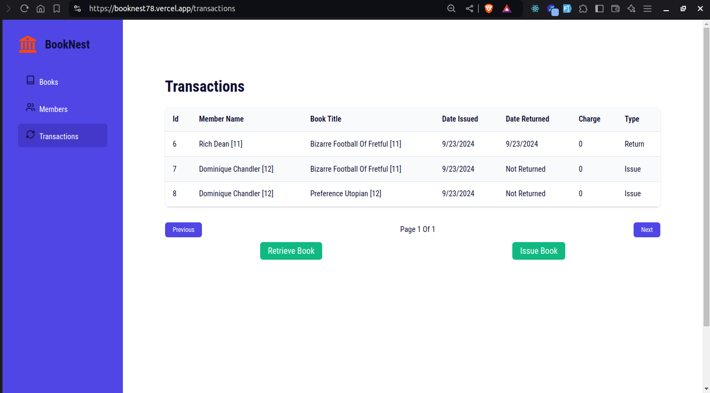

### 4. Create book

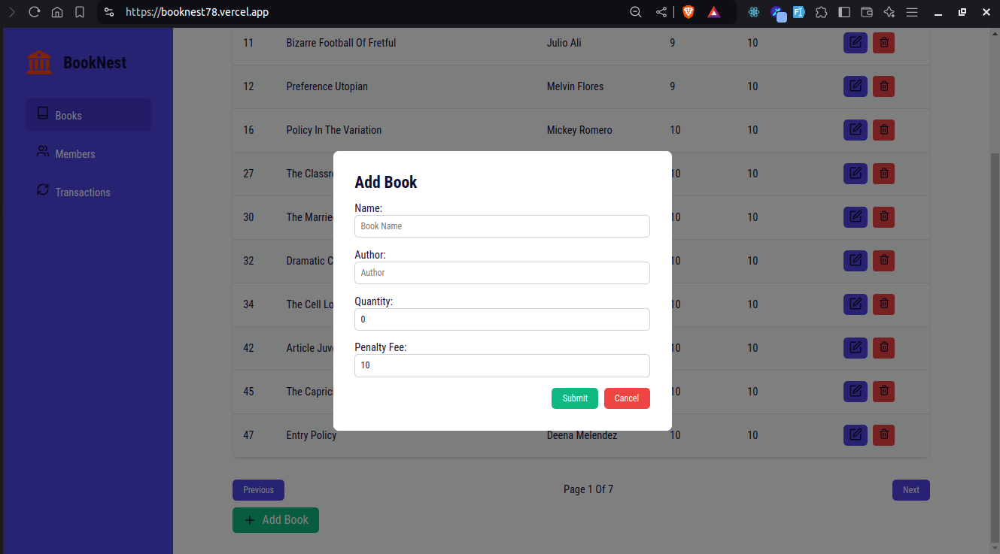

### 5. Update book

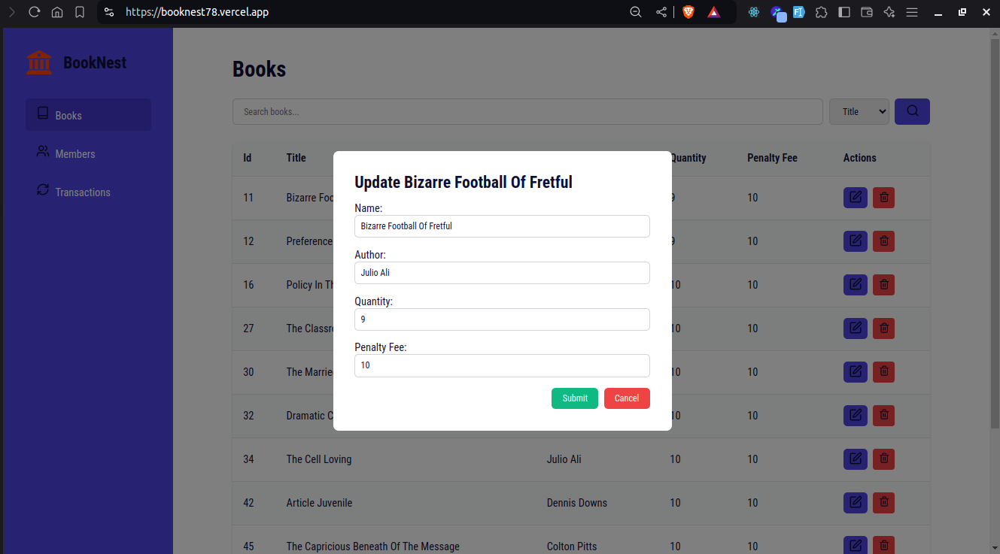

### 7. Register Member

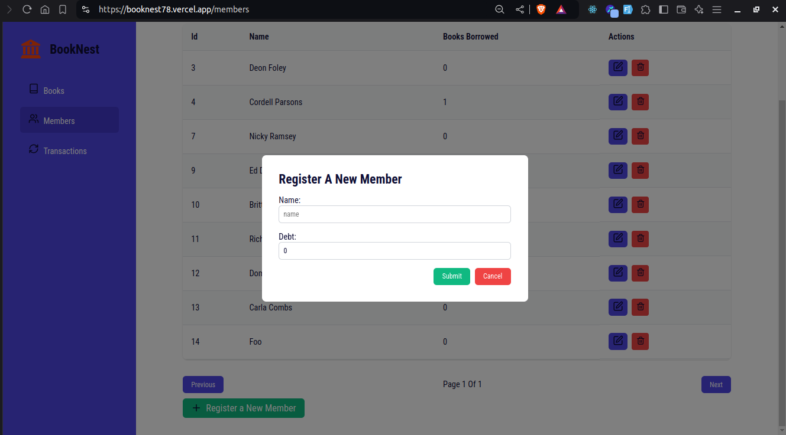

### 8. Update Member

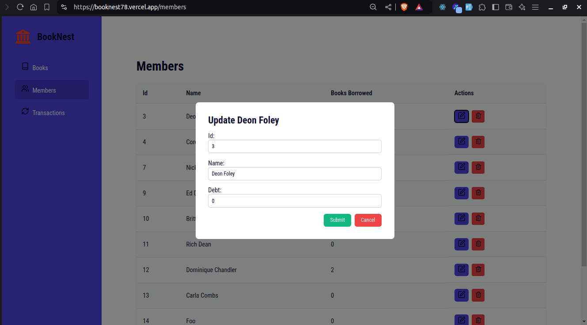

### 9. Transactions

#### 9.1. Issue Book to Member


#### 9.2. Retrieve Book

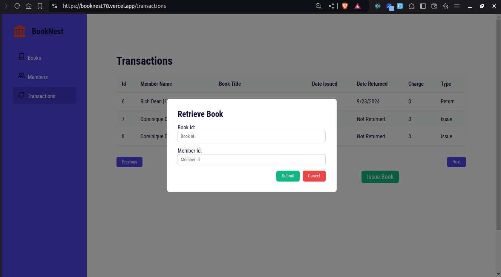

### 10. Search Books

#### 10.1. Search Books by Title

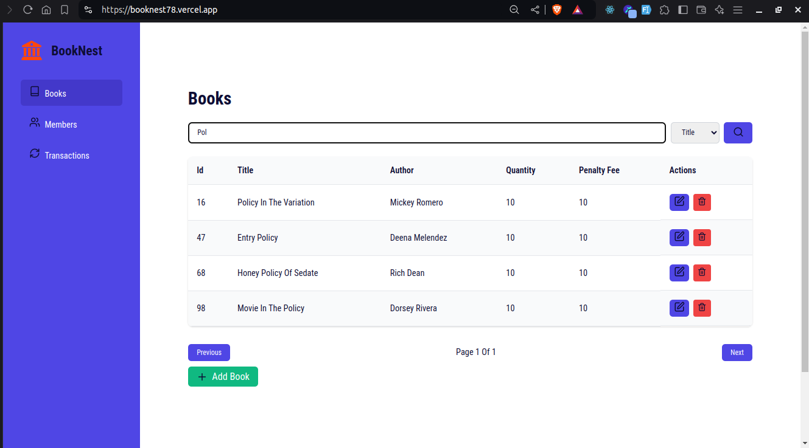

#### 10.2. Search Books by Author

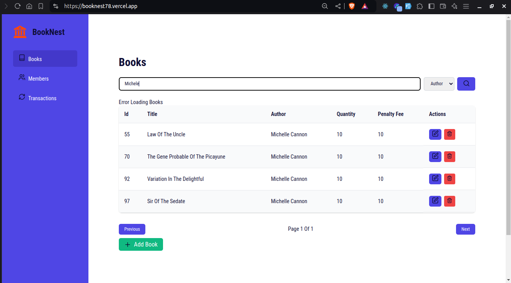

## Other Features

- Pagination
- Deleting a book
- Deleting a member

## Technologies Used

1. [React](https://reactjs.org/): Used for building the user interface.
2. [Vite](https://vitejs.dev/): Used for building the project.
3. [React Router](https://reactrouter.com/): Used for routing.
4. [axios](https://axios-http.com/): Used for making HTTP requests.

## How to run the project

1. Clone the project

```bash
git clone https://github.com/SymonMuchemi/BookNest-Client.git
```

2. Change into the project directory

```bash
cd BookNest-Client
```

3. Install dependencies

```bash
npm install
```

4. Start the development server

```bash
npm run dev
```

5. Open the browser and navigate to `http://localhost:3000/`
6. You can now interact with the application.
7. To build the project, run `npm run build`

## Author

- [Symon Muchemi](https://github.com/symonmuchemi)
